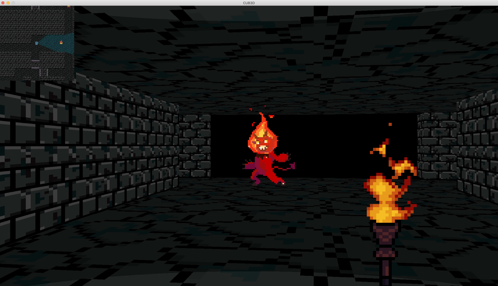
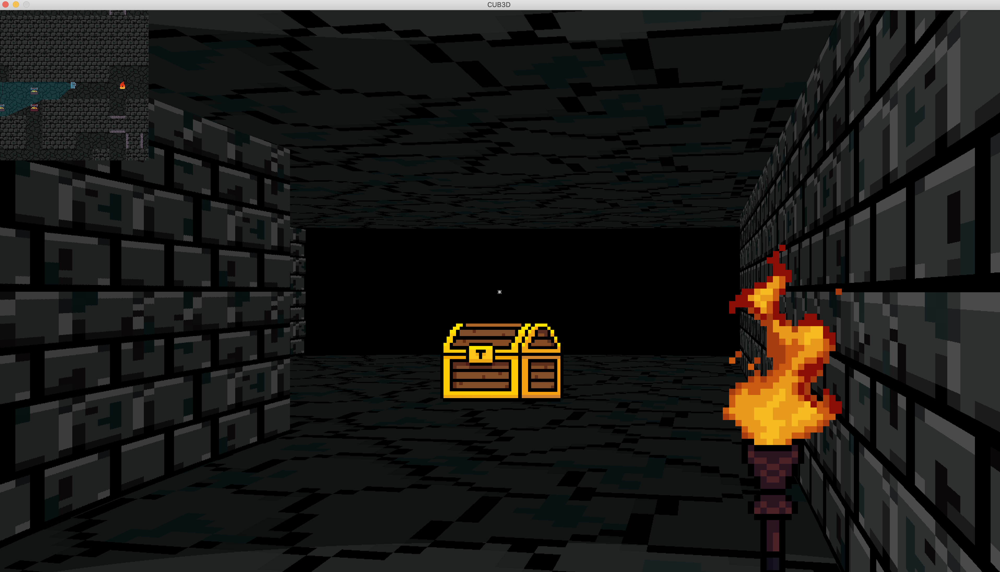

<p align="center">

</p>

# How to download & execute
- Go to releases and download the last release for your OS or git clone directly from this repository
- Copy this command to your terminal to install brew with [(Click here in order to install to 42 campus computers)](#how-to-install-brew-to-42-computers)
```bash
/bin/bash -c "$(curl -fsSL https://raw.githubusercontent.com/Homebrew/install/HEAD/install.sh)"
```
- Download glfw with ```brew install glfw``` or any packet downloader of your choice
- Go to the game folder (directory) where the ```Makefile``` is
- Write this command to your terminal: ```make re``` 
- Write this command to your terminal to start the game: ```./cub3d```
- Enjoy :)

</br>
<p align="center">

</p>
</br>

<table>
<tr>

<td>

</td>

<td>

</td>

</tr>
</table>

</br>

## Controls

```W```  Move Forward

```S```  Move Back

```D```  Move Right

```A```  Move Left

```F```  Open Doors

```ESC```  To Switch Main Menu

```Mouse Move``` Look Around

</br>

## Instructions

You are in a dungeon to collect some hidden quests. Use ```W A S D``` buttons to move and use ```mouse``` to look around. But be careful!

Quest guard Luci doesn't like people who try to steal his treasures. 

Hence, it will be following you. Watch your six!

</br></br></br>

### How to install brew to 42 computers?

```bash
rm -rf $HOME/.brew && rm -rf $HOME/goinfre/.brew && git clone --depth=1 https://github.com/Homebrew/brew $HOME/goinfre/.brew && echo 'export PATH=$HOME/goinfre/.brew/bin:$PATH' >> $HOME/.zshrc && source $HOME/.zshrc && brew update
```
